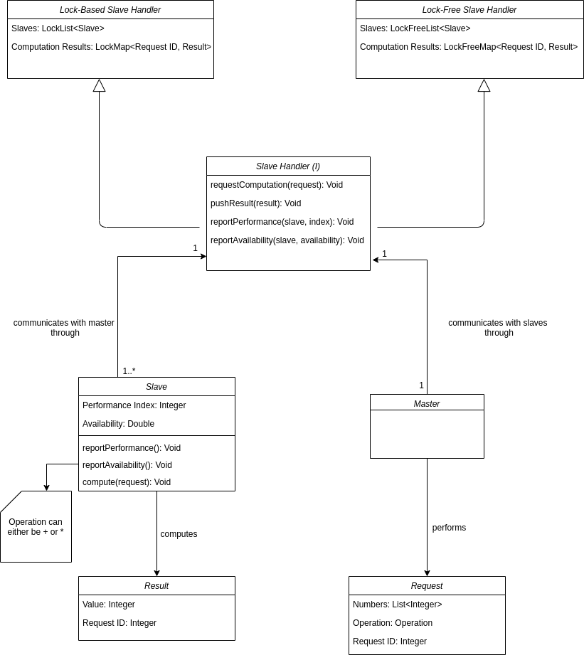
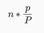
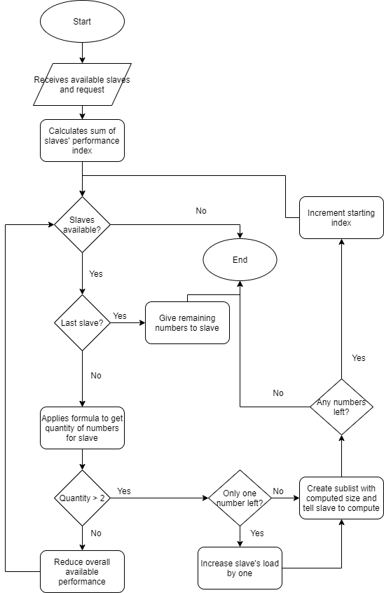
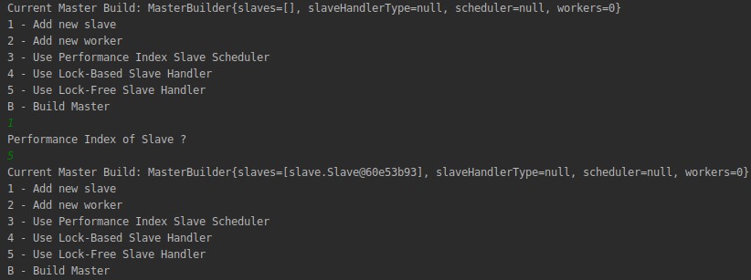
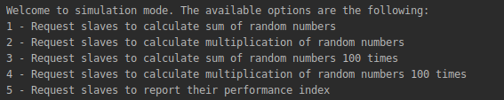
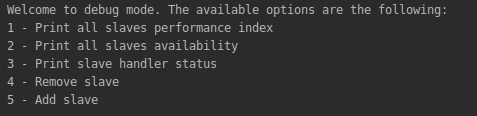

# IoT Cluster Simulation and Analysis

This repository holds the documentation and code of the project developed for SOCOF (Software Concorrente e Fiavel) curricular unit of MEI (Mestrado em Engenharia Informática) at ISEP (Instituto Superior de Engenharia do Porto). It addresses the topic of delegating tasks to a network of computers, mentioned as Slave nodes, from a central computer, mentioned as Master node, following the parallel programming paradigm.

The development was divided in three parts, being the first two the implementation of the slave and master nodes management and the last to prepare the solution to receive several types of input data and to review analyze it. Additionality coding guidelines were also defined in order to facilitate the communication between developers.

## Coding Guidelines

This project was developed using Java with the JDK version 8. All the code is written in english and camelCase is used as a naming convention. For testing we used the JUnit 4 library and all external dependencies present in unit tests were mocked with Mockito.

## Domain Concepts

Before attempting to sketch a domain diagram that exposes the domain concepts and their relationships, the team agreed that it was necessary to first think in all problem requirements and in the context of a simulation. Visualizing the problem from a non-technical perspective is easy. We have one master that controls a set of slaves, in which the slaves receive computation requests and answer the results. Now let's take a step further into the problem in a more fine-grain and technical perspective. Independently of the environment which the slaves and nodes are deployed in, there is communication between these that needs to be synchronized in some sort, so that data consistency is fulfilled. The critical point that needs to be tackled to keep the data consistency is the read and write operations of the shared memory that will store the result values. To comply with such, there is the need of using synchronization mechanisms such as locks or lock-free algorithms. Generally lock-free algorithms are more efficient and thus faster due to not requiring CPU additional work to control the threads / processes, but have the disadvantage of not being available in all CPU architecture, as these require the `CMPXCHG` (Compare-and-Swap) instruction to work. Given this, as we are conceiving a simulation, and not implementing a solution for a specific domain, it is required to provide a solution that covers both cases. Given this, the team conceived the following domain diagram:



<center>Figure X - Simulation Domain Diagram</center>

As observed in the diagram, besides the concepts that were knew previously, there is now the concept of `Slave Handler` and `Slave Scheduler`. Slave Handler can be seen as a middleman between Master and the Slaves, that manages the communication between these and the storage of the result values. Being the one who requires communication synchronization, it needs to be an abstraction to provide both implementation for lock-based and lock-free mechanisms. Slave Scheduler on the other hand is a strategy for the division of the requests that require computation in parcels that will be delivered to the slaves. Master and Slaves only receive and perform requests, as all the management logic of both requests is centralized in the Slave Handler implementation. For example, it is the slave handler implementation responsibility to contact the slave and update its properties such as its availability.

## Slave Node Implementation (Part 1)


## Master Node Implementation (Part 2)

<<<<<<< HEAD
As described in the **Domain Concepts** section, for this project it was introduced the concept of *Slave Handler*, which is a middleman between the Master ands its slaves. Master instead of communicating directly with the slaves, sends commands to `SlaveHandler`, which will then communicate with the slaves. Slaves communicate the results of the requests and the various reports to the SlaveHandler, which SlaveHandler will process the input of the slaves (e.g. store the result in the shared datastructure), and then once all results are gathered, communicates the final result to Master. With this approach, it is possible to create two simulation environments, one in which *Locks* are used to control the concurrency in the shared datastructure access by the threads (`LockBasedSlaveHandler`) and one in which *LockFree* algorithms / datastructures are used to remove the usage of locks by the threads. The same approach is also used to control the availability decrementer and increment of the slaves, as its the SlaveHandler responsibility to control this. There is also another abstraction (`SlaveScheduler`) related to the scheduler of the requests to the slaves, which knows how to properly balance the load in smaller parcels, that are given to the slaves to process. Master is the one responsible to indicate SlaveHandler which scheduler implementation to use. The implementation available (`PerformanceIndexSlaveScheduler`) will be explained in the section below.

### Load balancing algorithm
=======
### Load Balancing Algorithm
>>>>>>> 30cffc3249a8b5e2cf912ca9f3d64ceb2788c22e

Before applying the load balancing algorithm the scheduler first detects if the request is for reporting the performance index or computing numbers. If it's for reporting performance the scheduler send the request for each slave that is available. Otherwise, if it's a request for computing numbers, the algorithm is applied and before sending the request it verifies if the slave is available and sends it if it is. In case it's not, the scheduler informs the slave handler that a slave could not process a request which is then rescheduled to another slave.

The formula used for deciding how many numbers each slave receives is as follows:



Where n is the total amount of numbers to distribute, p is the current slave's performance index and P is the sum of all slave's performance. This formula always results in values between 0 and the total amount of numbers and the slaves with higher performance get a more numbers to process.

In case there are slaves with such a low performance index that the formula returns values inferior to 2 those slaves receive no numbers and P is decremented by that slaves' performance index.

In the event that the amount of remaining numbers is 1 we increment the amount of numbers that the current slave needs to process.

Afterwards, a sublist is created from the numbers' list starting from a starting index, which begins as 0, to a end index which is the sum of the starting index and the number computed from the previous formula. This sublist is then sent to the respective slave for computation.

Then the starting index is incremented to become equal to the end index and we redo the steps above for the next slave. This continues until there are no slaves or numbers left to distribute.

Due to the numbers in the formula being rounded because of floating values, there can be some cases where the total number of distributed values is less or more than the supposed. Therefore we introduced two conditions: the first is that the last slave always receives the remaining numbers, this slave has the highest performance since the slave list is sorted according to the slave's performance index, the second condition is if the sum of the starting index and the number computed by the formula is more than the value of the total numbers then the end index is equated to the value of the total numbers. These conditions can be observed as code below.

```
if(i == slaves.size()-1){
	//create sublist from current start index to the value of total numbers.
	...
	break;
}
...
if(numbersSize-endIndex < 2){
	//this condition also includes the case where the amount of remaining numbers is 1
	endIndex=numbersSize;
}

```

In the flowchart below it is possible to observe the process described above that defines this load balancing algorithm.



## System Integration and Analysis (Part 3)

### Simulation Interface

To ease the simulation live test, a CLI (Command Line Interface) named **Simulation** was conceived, in order to allow the interaction with the implemented functionalities. It provides three main options:

1. Build a new master for simulation
2. Start a simulation
3. Debug Mode

The first one allows the creation of multiple masters, in order to be possible to test the simulation in different environments. Once this option is seleced, the users need to provide the required input to build a master able to simulate the functionalities, explicitly:
 - The slaves to process the request, by providing their performance index as seen in Figure X
 - The workers, which are threads that will be available in a *ThreadPool* to send requests to the SlaveHandler and receive the respective results;
 - Options to select the slave scheduler and slave handler to use.

 

 <center>Figure X - Adding a slave in the build of a master</center>

Once a master is built, users can now enter the `Start a Simulation` page, which request the user to select a master under simulation. Once a master is selected, the CLI presents five options, which allow sending a single request to either process the computation of the sum / multiplication of random numbers, or also send a group of 100x requests of random numbers to either process the sum or multiplication of these. These last ones are very useful to test how the system behaves under multiple concurrent requests, with a moderate amount of load. Once these options are selected, the CLI starts to present the expected result and the ID of the request which is supposed to have the same result after the slaves process it. Finally it is also possible to request the slaves to report their performance index.



 <center>Figure X - Available options in Simulation Page</center>

Last but not least, the `Debug Mode` page, allows the users at any time, to inspect the current status the slave handler (e.g. see the remaining requests left to be processed), inspect the availability and performance index of the requests, remove and add a new slave. In the same way as the `Simulation` page, to access these options it is first needed to select a master under observation.

Additionally, to improve the usability of the CLI, users can refresh their page or go back to the initial page at any time by pressing the 'r' and 'h' buttons respectively. 



 <center>Figure X - Available options in Debug Mode Page</center>

### Research Topic Analysis

 * [What should be done to support tasks with different computational complexity (not necessarily
resulting from data decomposition operations)?](research-topics/support_tasks_with_different_complexity.md)
 * [How to guarantee that tasks don’t interfere with the node natural functionality?](research-topics/task_isolation.md)
 * [How to measure the performance of a node in a real case?](research-topics/real-world_performance_measurament.md)
 * [What languages and platforms to choose in a real-world implementation and why?](research-topics/real-world_platform_for_implementation.md)

### Team Members

`Francisco Machado 1150445@isep.ipp.pt`

`João Freitas 1160907@isep.ipp.pt`

`Ricardo Barros 1191202@isep.ipp.pt`