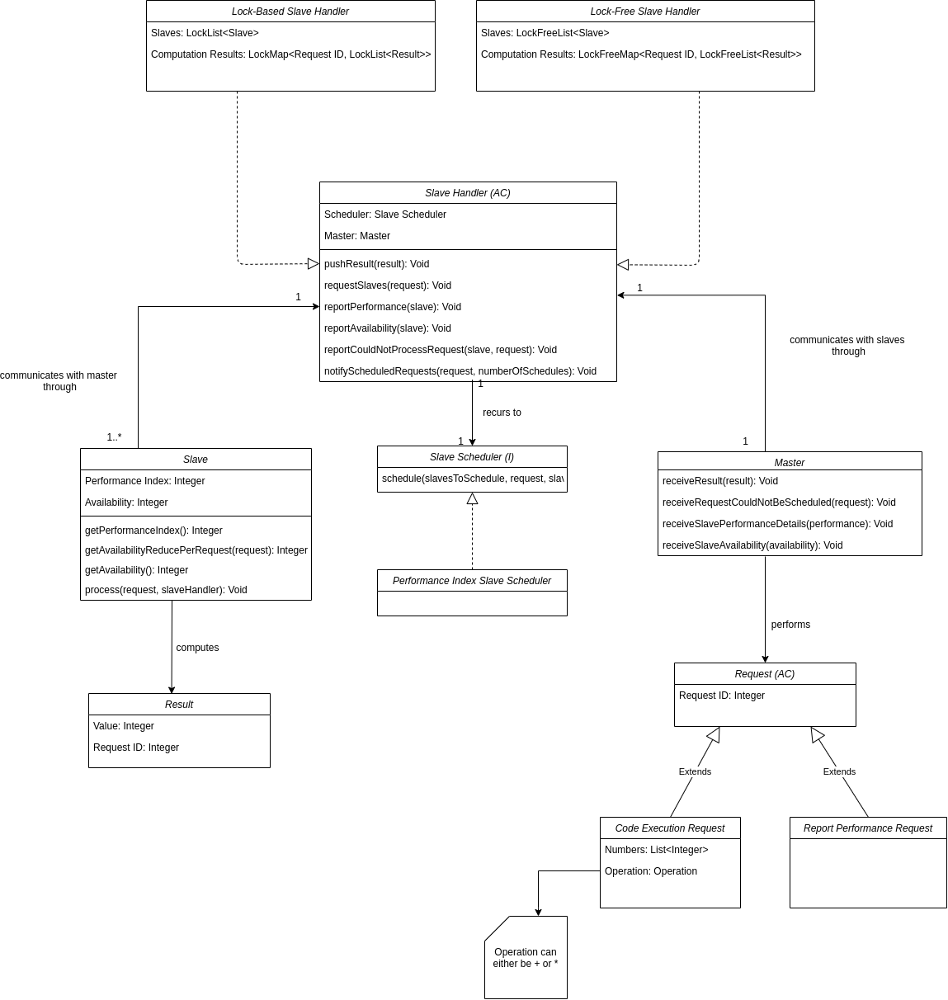

# IoT Cluster Simulation and Analysis

This repository holds the documentation and code of the project developed for SOCOF (Software Concorrente e Fiavel) curricular unit of MEI (Mestrado em Engenharia Informática) at ISEP (Instituto Superior de Engenharia do Porto). It addresses the topic of delegating tasks to a network of computers, mentioned as Slave nodes, from a central computer, mentioned as Master node, following the parallel programming paradigm.

The development was divided in three parts, being the first two the implementation of the slave and master nodes management and the last to prepare the solution to receive several types of input data and to review analyse it. Additionality coding guidelines were also defined in order to facilitate the communication between developers.

## Coding Guidelines

## Domain Concepts

Before attempting to sketch a domain diagram that exposes the domain concepts and their relationships, the team agreed that it was necessary to first think in all problem requirements and in the context of a simulation. Visualizing the problem from a non-technical perspective is easy. We have one master that controlls a set of slaves, in which the slaves receive computation requests and answer the results. Now let's take a step further into the problem in a more fine-grain and technical perspective. Independently of the environment which the slaves and nodes are deployed in, there is communication between these that needs to be synchronized in some sort, so that data consistency is fulfilled. The critical point that needs to be tackled to keep the data consistency is the read and write operations of the shared memory that will store the result values. To comply with such, there is the need of using synchronization mechanisms such as locks or lock-free algorithms. Generally lock-free algorithms are more efficient and thus faster due to not requiring CPU additional work to control the threads / processes, but have the disadvantage of not being available in all CPU architecture, as these require the `CMPXCHG` (Compare-and-Swap) instruction to work. Given this, as we are conceiving a simulation, and not implementing a solution for a specific domain, it is required to provide a solution that covers both cases. Given this, the team conceived the following domain diagram:



<center>Figure X - Simulation Domain Diagram</center>

As observed in the diagram, besides the concepts that were knew previously, there is now the concept of `Slave Handler` and `Slave Scheduler`. Slave Handler can be seen as a middleman between Master and the Slaves, that manages the communication between these and the store of the result values. Being the one who requires communication synchronization, itself needs to be an abstraction to provide both implementation for lock-based and lock-free mechanisms. Slave Scheduler on the other hand is a strategy for the division of the requests that require computation in parcels that will be delivered to the slaves. Master and Slaves only receive and perform requests, as all the management logic of both requests is centralized in the Slave Handler implementation. For example, it is the slave handler implementation responsibility to contact the slave and update its properties such as its avaiability.

## Slave Node Implementation (Part 1)


## Master Node Implementation (Part 2)

### Load balancing algorithm

The formula used for deciding how many numbers each slave receives is as follows:


Where n is the total amount of numbers to distribute, p is the current slave's performance index and P is the sum of all slave's performance. This formula always results in values between 0 and the total amount of numbers and the slaves with higher performance get a more numbers to process.

In case there are slaves with such a low performance index that the formula returns values inferior to 2 those slaves receive no numbers and P is decremented by that slaves' performance index.

In the event that the amount of remaining numbers is 1 we increment the amount of numbers that the current slave needs to process.

Afterwards, a sublist is created from the numbers' list starting from a starting index, which begins as 0, to a end index which is the sum of the starting index and the number computed from the previous formula. This sublist is then sent to the respective slave for computation.

Then the starting index is incremented to become equal to the end index and we redo the steps above for the next slave. This continues until there are no slaves or numbers left to distribute.

Due to the numbers in the formula being rounded because of floating values, there can be some cases where the total number of distributed values is less or more than the supposed. Therefore we introduced two conditions: the first is that the last slave always receives the remaining numbers, this slave has the highest performance since the slave list is sorted according to the slave's performance index, the second condition is if the sum of the starting index and the number computed by the formula is more than the value of the total numbers then the end index is equated to the value of the total numbers. These conditions can be observed as code below.

```
if(i == slaves.size()-1){
	//create sublist from current start index to the value of total numbers.
	...
	break;
}
...
if(numbersSize-endIndex < 2){
	//this condition also includes the case where the amount of remaining numbers is 1
	endIndex=numbersSize;
}

```

In the flowchart below it is possible to observe the process described above that defines this load balancing algorithm.


## System Integration and Analysis (Part 3)

### Team Members

`Francisco Machado 1150445@isep.ipp.pt`

`João Freitas 1160907@isep.ipp.pt`

`Ricardo Barros 1191202@isep.ipp.pt`