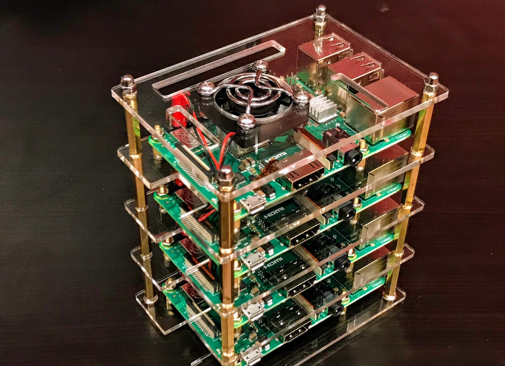

# What languages and platforms to choose in a real-world implementation and why?

## Introduction

Our ambition may be to innovate and find a solution which grants us of high-levels of performance, with literally no time splits between the request start and the response arrival, by designing our desires as such, but this is theoretically speaking, where the concept of utopy takes place. In practice our desires are limitted to computational resources that are given by the computers which will perform the computation requests and the infrastructure that supports it. Technically speaking, if our problem is the lack of computational resources, we can always obtain more of these and scale our solution in space. Yet this brings us a bigger problem which is the cost of doing such. But we can be smarter and play with what we have and what is available to us, by conjugating our problem domain with the available technologies and computers. That being said it is possible to express this conjugation in two extrinsinc domains: platform (computer) and (programming) language.

## Platform(s) Analysis and Decisions

To conclude what platform to use, there is the need to analyze the domain drivers. It is known that the target achievement is the sum or product of integer lists. It is also known that multiple requests of these computations can occur and that large integer lists increase the computation time. To tackle these issues, in the scope of the computation domain, the problem is decentralized to a master and a group of slaves: the conductor and its orchestra. The slaves perform computational requests whereas the master commands the whole operation, by splitting the integer list in smaller parcels (load balancing) and sending these to the slaves (work distribution). This leads to a bigger memory usage on Master and bigger CPU usage on Slaves side. This two concerns already constrain the language in which both sides will be programmed on. Also Slaves do not require any complex algorithm to perform the computation as they either sum or product numbers, while iterating an array, which in the perspective of the processor is just executing `ADD` and `JMP` instructions. From this it is possible to conclude that Master will require a programming language which provides a stable and reliable memory management, whereas Slave requires a language that provides fast operations execution, and that it is not necessary an *high-end* computer to perform the computation of the requests. Master also requires the store, join and watch of slaves results, which leads to concurrent operations on a shared datastructure. To keep the consistency of the datastructure records and operations atomicity, its either necessary the use of locks or lock-free algorithms. Lock-free operations are far more efficient than Lock operations as these do not require additional CPU work on controlling processes / threads access to critical regions, but require the ISA (Instruction Set Architecture) of the CPU to provide the `CMPXCHG` (Compare-and-Exchange/Swap (CAS)) instruction or alternatives to achieve an atomic CAS. Finally, to conclude on the platform requirements, it is also required that Master and Slaves communicate with each other. To allow such there is the need to establish a messaging protocol that both parties understand. There are several standardized protocols, each with their advantages and disadvantages, such as `OpenMPI` [1], `MQTT` [2], `AMQP` [3], `HTTP` [4] and `Websocket` [5]. Since the infrastructure and implementation are not complex, it is only required to choose one protocol that is reliable, fast and has support in the chosen programming language.

Given the requirements for the platforms, it is proposed that a cluster of Raspberry Pi nodes is assembled, as seen in Figure 1, connected through Gigabit Ethernet cables, as each of these computers is relatively cheap and fit the requirements. There are various models of Raspberry Pi, each with different specifications, but share the same CPU ISA family (ARM). Desirably, each Slave node would run on a `Raspberry Pi 3 Model B+`, which has a `64-bit Broadcom BCM2837B0, Quad core Cortex-A53 (ARMv8)` processor spanned in four cores, with a maximum speed of `1.4GHz` (Theoretically, at least 1400 million instructions per second) [6,7]. These nodes would have the maximum performance index, but other nodes with less performance index could be introduced, by plugging in older Raspberry Pi models, such as the `Raspberry Pi 2 Model B` [8] and `Raspberry Pi 1 Model B+` [9], which have less computational power and do not support the Gigabit Ethernet cables, reducing the throughput of the communication and thus increasing the communication latency. The master would run on a `Raspberry Pi 4 Model B` that includes a `64-bit Broadcom BCM2711, Quad core Cortex-A72 (ARM v8)` processor with up to 2, 4 or 8GB of RAM [10]. This is great for Master as it has a lot more primary memory which can be used to store the records of the shared datastructure as well to store the temporary array parcels that are split on master request.

Figure 1 - Cluster of 4 Raspberry Pi serving a Kubernetes Cluster, taken from https://medium.com/nycdev/k8s-on-pi-9cc14843d43

Alternatively to the usage of Raspberry Pi as the computers, other market computers/boards can be used [11] such as the `ASUS Tinker Board S` [12], but might be more expensive and the CPU ISA might not support the CAS operation, which is necessary for Master lock-free data structure. Also alternatively to building a cluster with physical hardware, one can also assemble the infrastructure in the cloud, but that also be much more expensive for the outcomes of the solution.

## Language(s) Analysis and Decisions

Given the platforms in which Master and Slave nodes programs will run on, it is now necessary to identify the proper programming languages to build the programs. Slaves core work is `ADD` and `JMP` instructions, so a native-compiled language is prefered than one language that compiles to bytecode and then interpreted by a virtual machine. To select the most deseriable programming language that allows the receive of a parcel of integers through the mentioned messaging protocols and that compiles to either 32 or 64 bit ARM code, benchmarks regarding the sum or product of an array of integers would have to be done. As the timeframe for this research topic does not cover the creation and execution of these benchmarks, it is necessary to make decisions based on open benchmarks available on the Internet. Taking into consideration the benchmarks of various programming languages regarding the matrix product of two arrays (matmul) [13], it is possible to observe that the top 5 programming languages that fit our requirements in the order of fastest to least fastest are: `D` [14], `Julia` [15], `Rust` [16], `C` [17] and `Go` [18]. D and Julia are not so popular but have modules specialized for parallel computing. Rust, C and Go are more popular also provide parallelism mechanisms. Although the requirement of a programming language that compiles to native ARM 32/64 bit code, the language `SWI-Prolog` [19] could also be put in action as it provides a powerful feature which is the knowledge base. By storing the parcels as facts, a caching mechanism could be created in order to reduce computation time and latency between replies. The disadvantage of this is that it would increase both primary and secondary memory usage.

Master on the other hand, has its core work in managing the incoming requests and the shared datastructure, as well as to split the integer list in parcels. As said before, Master requires effiecent and stable memory management, which is often provided by GC (Garbage Collected) languages, so the use of non GC languages such as C++ [20] could be dangerous. Although this last statement, the language Rust does not have a garbage collector but is memory safe, by enforcing memory management at compile time, which reduces the overhead of the garbage collector [21]. That being said, the usage of Rust to program Master could be the way to go.

## Sources

1 - https://www.open-mpi.org/, accessed on 30/05/2020.

2 - http://mqtt.org/, accessed on 30/05/2020.

3 - https://www.amqp.org/, accessed on 30/05/2020.

4 - https://tools.ietf.org/html/rfc1945, accessed on 30/05/2020.

5 - https://developer.mozilla.org/docs/WebSockets, accessed on 30/05/2020.

6 - https://www.raspberrypi.org/products/raspberry-pi-3-model-b-plus/, accessed on 30/05/2020.

7 - https://en.wikipedia.org/wiki/Instructions_per_second#Millions_of_instructions_per_second_(MIPS), accessed on 30/05/2020.

8 - https://www.raspberrypi.org/products/raspberry-pi-2-model-b/, accessed on 30/05/2020.

9 - https://www.raspberrypi.org/products/raspberry-pi-1-model-b-plus/, accessed on 30/05/2020.

10 - https://www.raspberrypi.org/products/raspberry-pi-4-model-b/specifications/, accessed on 30/05/2020.

11 - https://itsfoss.com/raspberry-pi-alternatives/, accessed on 30/05/2020.

12 - https://www.asus.com/Single-Board-Computer/Tinker-Board-S/, accessed on 30/05/2020.

13 - https://github.com/kostya/benchmarks#matmul, accessed on 30/05/2020.

14 - https://dlang.org/, accessed on 30/05/2020.

15 - https://julialang.org/, accessed on 30/05/2020.

16 - https://www.rust-lang.org/, accessed on 30/05/2020.

17 - https://en.wikipedia.org/wiki/C_(programming_language), accessed on 30/05/2020.

18 - https://golang.org/, accessed on 30/05/2020.

19 - https://www.swi-prolog.org/, accessed on 30/05/2020.

20 - https://en.wikipedia.org/wiki/C%2B%2B, accessed on 30/05/2020.

21 - https://blog.discord.com/why-discord-is-switching-from-go-to-rust-a190bbca2b1f, accessed on 30/05/2020.