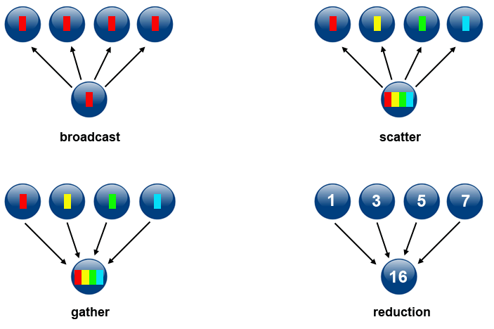

# What should be done to support tasks with different computational complexity ?

## Introduction

Computers have progressed significantly since the time they were created. Instead of having a processor with only one core, nowadays the number of cores in processors have been increasing to the point where it's easier to find processors with multiple cores than with only one. This allows programs to be more efficient in their execution since they have more resources available. But in order to make use of all these cores, we need to write programs capable of using them by making use of parallel computing which allows us to reduce the time needed for completing tasks. Most parallel solutions consist of decomposing the original problem into multiple smaller tasks and processing them separately and finally joining them to obtain the result. A methodical design for parallel solutions is presented in [1] containing four stages: partitioning, communication, agglomeration and mapping. In this analysis we will cover partitioning, communication and mapping, while this last one is simplified as load balancing or work distribution. Finally we will answer the proposed question "What should be done to support tasks with different computational complexity ?" and associating it with developed project.

## Partitioning

There are multiple ways of decomposing a given problem and we need to find the most effective technique for each specific problem. In [1] and [2] there are two categories of decomposition that complement each other. **Domain Decomposition** where the data is decomposed in several parts where each part is handled by one task that operates on it. **Functional Decomposition** focuses on creating tasks with different computations that compute a portion of the overall work, for example a climate modeling system can be separated into the atmospheric model, ocean model, etc. where each part has different computations. When using this decomposition attention is needed to be given to the communication between parts so that data duplication is avoided, in cases where a large quantity of communication is needed domain decomposition is advised to be used instead.

Multiple domain decomposition techniques are presented in [3]:

* Recursive decomposition - a problem is divided in independent subproblems which in turn are divided recursively in even smaller independent subproblems where the results are later combined. The quicksort algorithm is an example of this composition.
* Data decomposition - first the data is decomposed in several parts where computation is performed and then these parts are computed by tasks. For example matrix multiplication where a matrix is divided in submatrices.
* Exploratory decomposition - used for problems that are searching in a space of solutions. The search space is partitioned into smaller parts and each is searched until the desired solution is found. An algorithm for finding the best move in a tick-tack-toe game can be an example if it searches all possible solutions.
* Speculative decomposition - used when the program has a defined number of possible branches it can take. While one task is computing the output that will decide the branch to take, other tasks are already computing those tasks. When the output is finally computed the result of the corresponding branch that was computed by the other task is used.

These decompositions can also be combined together and used in different stages, for example counting how many prime numbers are in a list can be decomposed firstly using data decomposition and then apply recursive decomposition on the resulting parts.

## Communication

There are two types of problems, the ones where the tasks need to communicate with each other and those that they don't. As presented in [2] these communications can be synchronous or asynchronous. In synchronous communications, also known as blocking, tasks need to wait for one another before proceeding with their work. While in asynchronous communication, also known as non-blocking, tasks compute their work and send a message to other tasks when their work is completed and start doing other work that they may have, while the tasks that receive the message process it whenever they are available.

In [2] it is also presented two types of communication scope, point-to-point where two tasks act as sender/producer and the other as receiver/consumer and collective where data is shared to a certain group. It is also identified four variations:

* Broadcast - where one task sends the same information to other tasks.
* Scatter - where one task divides the information and send to each part to a different task.
* Gather - A task receives different information from other tasks and combines it.
* Reduction - A task receives different information from other tasks and computes the final result.

## Load Balancing / Work distribution

Load Balancing is used to distribute work between several tasks while making sure that none of them are idle if there is work to be computed. This is important for parallel programs in order to reduce the time needed for finishing the overall computation.

There are two types of load balancing, as presented in [4], static and dynamic. In static load balancing the workload for each task is computed by a work distribution algorithm before it is assigned to threads, after this assignment the workload is not changed. In dynamic load balancing there are more types, as presented in [4] and [5]:

* Task-oriented - When one thread finishes its task, it is assigned another task.
* Data-oriented - When one thread finishes its task, the thread with most work gives some of its work to the former thread.
* Work dealing - An overloaded thread tries to transfer some of its work to another thread with more availability.
* Work stealing - When one thread finishes its task, it tries to "steal" work from a random thread.
* Work balancing - Each thread has a chance of periodically balancing its workload with a random thread.

## Conclusion

A program with tasks that have different computational complexity means that it has tasks with different types of computations which can lead to functional decomposition. In terms of communication it should use asynchronous/non-blocking communication since it provides better performance. Dynamic load balancing should be used since it is more flexible, the specific type should be selected after a thorough analysis of the overall problem or even have different load balancing types for each functional part found.

In the case of our simulation of master and slave communication our slave has two different threads for different types of computation, this can be seen as functional decomposition. The communication used, when using the lock free slave handler is asynchronous when it used the lock based slave handler it's synchronous. The communication scope between the slaves and master has two sides: the master first scatters the workload to the multiple slaves and then it does a reduction with the results of each slave, since it computes the final result. The workload is balanced using a static load balancing algorithm that decomposes data according to the performance of the slaves available.

In a real project the slave could be functionally decomposed in two modules, equivalent to the threads used in the simulation, performance report module and computing module, this last one could be further decomposed for each of the supported operations (sum, multiplication). The communication should be asynchronous and its scope the same as in the simulation. The master could continue to use a static load balancing algorithm according to the performance of each available slave but a dynamic load balancing could prove to be beneficial since slaves have performances that are hard to quantify. A task-oriented approach could be used since it doesn't require communication between slaves. For the other dynamic approaches the master would need a significant amount of extra communication since in this architecture the slaves shouldn't communicate with each other. In terms of the data decomposition used by the load balancing algorithm it should use data decomposition as in the simulation.

## Sources

1 - Foster, I. (1995). *Designing and building parallel programs: concepts and tools for parallel software engineering*. Addison-Wesley Longman Publishing Co., Inc.

2 - Barney, B. (2010). Introduction to parallel computing. *Lawrence Livermore National Laboratory*, *6*(13), 10.

3 - Grama, A., Kumar, V., Gupta, A., & Karypis, G. (2003). *Introduction to parallel computing*. Pearson Education.

4 - Types of Scheduling Algorithms in Parallel Computing, Arun Seth, Vishaldeep Singh, International Research Journal of Engineering and Technology (IRJET)

5 - Herlihy, M., & Shavit, N. (2011). *The art of multiprocessor programming*. Morgan Kaufmann, chapter 16.

